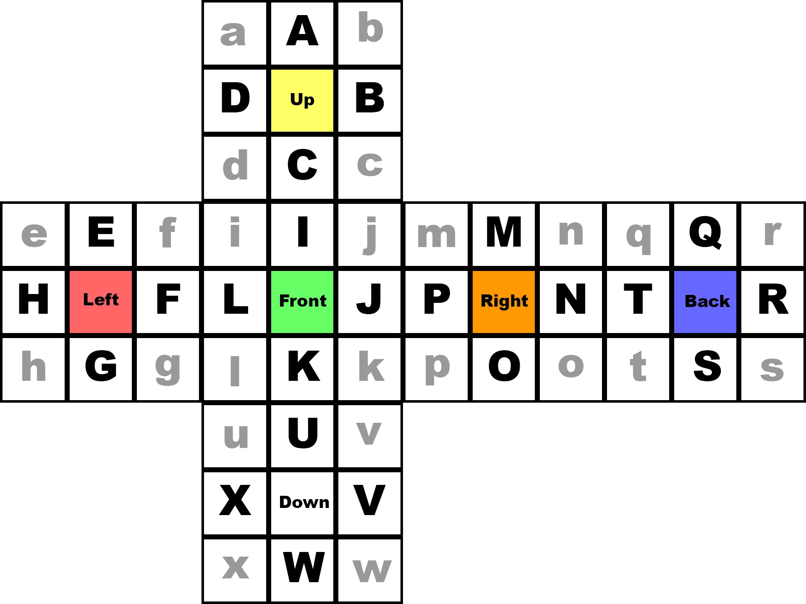

---
tags:
    - speedcubing
title: First successfull 3x3 blindsolve
date: 2022-03-12
cover: thumbnail.webp
excerpt: After over 10 years of speedcubing I finally decided to give it a try to perform a blindsolve. After a few days I was finally able to do it. Here's how I got there.
draft: false
---

**tl;dr**&mdash;*I did it. It took me about 4 days of practice and the solve was a little over above 10 minutes. Check out the [video below](#video)*

Those of you who know me in person, know that I've been doing speedcubing for over 10 years already. I don't really remember when I really started but I know that my first official competition was 2011 in the Netherlands. Here's a [video from said competition](https://youtu.be/DLfM8VXO-GM)&mdash;my first official personal best time. (btw I absolutely loved that purple tattooed Darth Vader shirt)

As you can see I was super excited, super happy, had a very lucky <span class="tooltip" data-text="A lucky coincidence in which you don't need to do the last step of the CFOP system">PLL skip</span> and *I did not have a beard*. The last one being the most weird of it all.
After competing in many more competitions, beating my personal best countless times and even going the [Las Vegas for the world championship in 2013](https://www.youtube.com/watch?v=kcIvwpm4PIc) it was now finally time to learn how to solve this damn puzzle blindfoled.

During my *active* years in the speedcubing community, between 2011 and 2014, I picked up many information on how to actually solve the standard 3x3 cube blindfolded but I never really tried to do it. I thought it would be too hard or too time consuming to learn a good and reliable memorization technique. Although I did solve the cube with eyes open, only using moves that would be used when solving it while eyes are closed (T-Perm, J-Perm and Y-Perm&mdash;together with some setup moves).

That's right, you only need the T- & Y-Permutation to solve a 3x3 Rubik's Cube blindfolded. But to be more precise and to also make it a little bit more convenient this is what you need:

- <span class="tooltip" data-text="R U R' U' R' F R2 U' R' U' R U R' F'">T-Perm</span>
- <span class="tooltip" data-text="R U R' F' R U R' U' R' F R2 U' R' U'">J-Perm</span>
- <span class="tooltip" data-text="F R U' R' U' R U R' F' R U R' U' R' F R F'">Y-Perm</span>
- <span class="tooltip" data-text="R U' R' U' R U R' F' R U R' U' R' F R">Y-Perm variation</span>
- <span class="tooltip" data-text="L U2' L' U2' L F' L' U' L U L F L2' U">R-Perm (Party-Algorithm)</span>
- A lot of setup moves: Intuitive
- A good memorization technique: [Old Pochmann](https://www.speedsolving.com/wiki/index.php/Classic_Pochmann)

So now it was time for me to check the last point on this list. The memorization. After some research I found some pictures that are actually describing the procedure so simple, I didn't have to do any more research but practice.



This is my own creation of the images that I found. Every corner and every edge has a letter assigned to it from A to X, fortunately you don't need to remember Y and Z (that would be too much, honestly &lt;/irony&gt;).

But how does it work? A quick description of how to remember the edge pieces. Holding the cube as pictured above, I start by looking at piece *B/M*, checking the *B*-sided color of it. Let's say at this position is the *red/green* piece. This has to go to location *F/L*&mdash;more precisely, if location *B* is *red*, then *B* has to be switched with *F*. Now I would continue like this all the way through. What is currently in location *F*, where does it need to go and where goes the next piece that is currently located in that position. I know, it sounds mind-bending but it is doable. Here's an example, sorting the letters by always only changing it with the first (top/left) position:

```markup
Change: E/B       Change: B/C       Change: C/D       Change: D/F       Change: F/A       Done.
|---|---|---|     |---|---|---|     |---|---|---|     |---|---|---|     |---|---|---|     |---|---|---|
| E | C | D |     | B | C | D |     | C | B | D |     | D | B | C |     | F | B | C |     | A | B | C |
|---|---|---| --> |---|---|---| --> |---|---|---| --> |---|---|---| --> |---|---|---| --> |---|---|---|
| F | B | A |     | F | E | A |     | F | E | A |     | F | E | A |     | D | E | A |     | D | E | F |
|---|---|---|     |---|---|---|     |---|---|---|     |---|---|---|     |---|---|---|     |---|---|---|
```

The full path to remember to solve this would be *EBCDFA*. Since we always use the top left box as a buffer location we don't need to remember what is in there at the beginning, so it becomes *BCDFA*. The last switch will automatically solve the A piece anyway, so we can get rid of this as well. Only remember *BCDF*. So change buffer with position B, then C, then D and finally F. Grid is solved. Solving the Rubik's Cube blindfolded follows the same idea. There are some more steps required but route to take is the same.

Remembering the whole route how to solve all edges and all corners can be quite challenging but luckily there are systems to help with that. Using a 2-letter-memorization and building a short story out of it is the key for me. So for example, having a string of letters like *HPBRLA* would become *HP-BR-LA* would become _<u>**H**</u>arry <u>**P**</u>otter flies a <u>**BR**</u>oom above <u>**L**</u>os <u>**A**</u>ngeles_. To remember a short story is a lot simpler than a cryptic string of random letters. Being able to put two letters into one word (like broom) helps a lot.

With that being said, I've spent some days doing the whole memo thing and solving the cube with eyes open as I would with my eyes closed, after feeling confident enough I started doing some blind edge-only and corner-only solves. Partly successful, but boosting my confidence even more. It didn't matter to me if 2 or 3 pieces were unsolved when I finished&mdash;to me this was a success already. But then it finally happened!

If you want to follow along, this is the scramble: `F L2 U2 L' D2 B2 L' F2 D2 R2 D2 B' L2 U' R F D' R2 D Rw2 Uw'`

<iframe width="560" height="315" id="video" src="https://www.youtube.com/embed/FDicNFKlGig?rel=0" title="YouTube video player" frameborder="0" allow="accelerometer; autoplay; clipboard-write; encrypted-media; gyroscope; picture-in-picture" allowfullscreen></iframe>

That's it. I'm happy and satisfied. For now. See you when it is time to break my personal best time :P