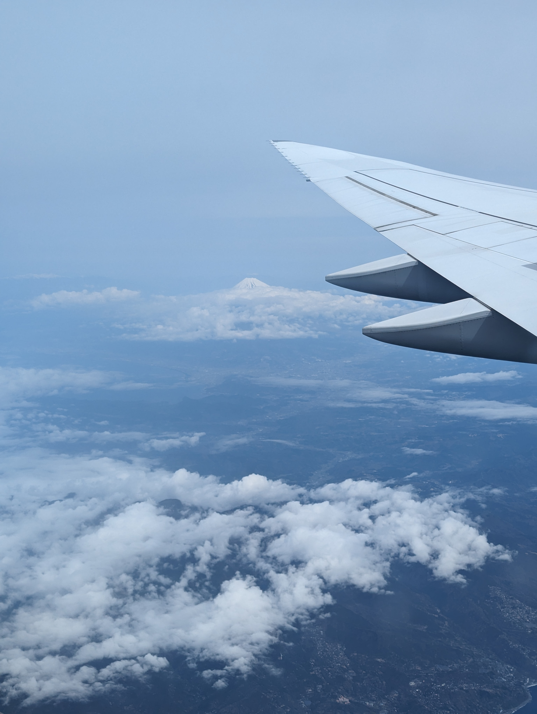
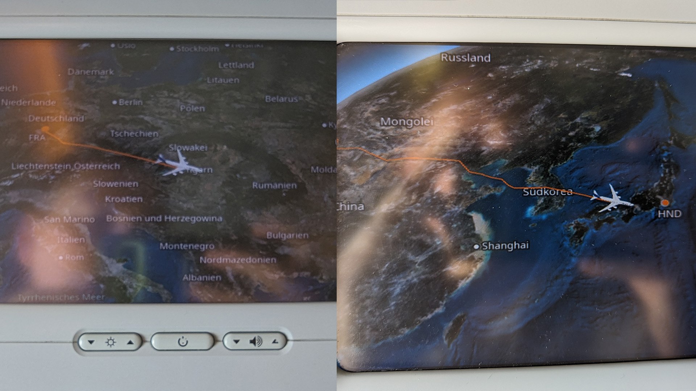
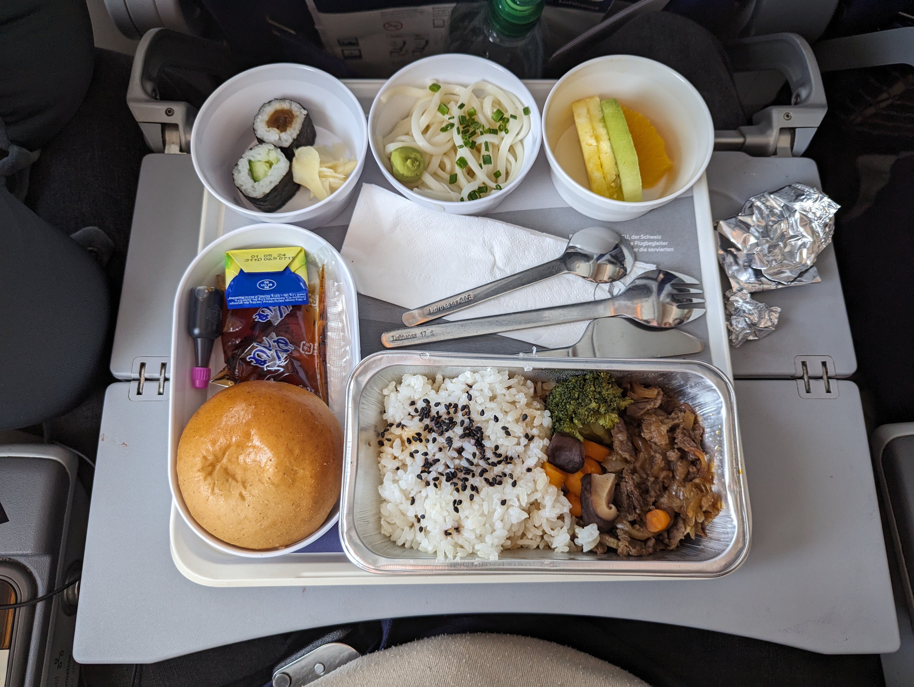
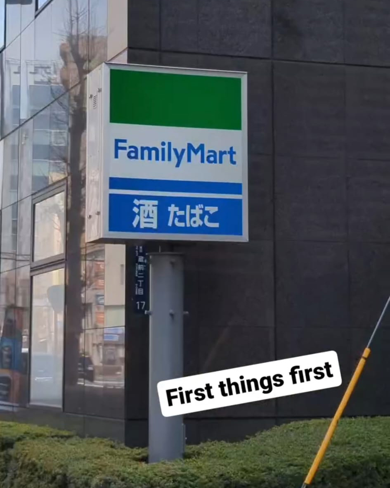

## Prologue

This post will cover the entirety of my trip to Japan, it’s probably going to be really long and contains a lot of pictures. I will probably post some other posts addressing places and/or events in more detail. Hope you enjoy!

tl;dr—I had the time of my life and I’m very sure I’ll come back to Japan for a second time in 2024. It already feels like I want to live and work there. Wanna see pictures? My Instagram highlights are at the very [bottom of this post](#stories) but there are also a couple of pictures and videos scattered throughout the text.

[TODO: auto generated index]

## How it started

皆さんこんにちは！As most of you know I started learning Japanese in October 2020, in the depths of boredom during the whole Covid situation. Since that time I always wanted to go to Japan, test my skills and soak in every single moment I can. Unfortunately it was not possible during Covid and I also had no good possibility after. When I passed the JLPT N5 test in July 2023 I was a little frustrated because I had proof that I was making progress but still no possibility in reach to do an actual field test outside of Germany.

I wrote a little post about recent changes in my life and what a struggle 2023 actually became for me. By the end of 2023, when I quit my job and flipped my life around, I realized I had to go to Japan as soon as possible. I knew it would have an enormous positive effect on my current state. I kind of fixed everything else but this puzzle piece was still missing.

In January 2024 I had a conversation with my mother. She has always been a very supportive person in my life and she knew about my love for the Japanese language and Japan. We were talking about random things when we suddenly came across the whole Japan topic. I told her that my plan was to go there in the first half of this year but I still had a bad feeling about it because of everything that didn’t really go well in the recent time. Supportive as always she managed to make me open a website to check flights, 30 minutes later I was in possession of plane tickets from Frankfurt to Tokyo and back. It would be an extreme understatement if I say I was shocked.

So it was end of January and my flight to Japan would leave in the beginning of April. I didn’t really plan anything except going to Tokyo, Kyoto and Osaka. Initially I also wanted to go to Hiroshima for a day trip and maybe to Fujiyoshida, right next to Mt. Fuji but I scratched that for now. I realized my two weeks wouldn’t be enough to fit everything in. I was okay with that.
About two weeks prior to my flight I was checking hotels and booked one in Kuramae (Tokyo) for the first week. Everything else I booked spontaneously. Buckle up and let’s dive right in.

## Eastbound 🛫

6th of April 2024. The day that had felt like an eternity away was finally there. [My flight](https://www.flightaware.com/live/flight/DLH716/history/20240406/1215Z/EDDF/RJTT) would leave Frankfurt airport at around 2pm (GMT+2) and was scheduled to arrive at Tokyo Haneda Airport at around 10am (GMT+9). It wasn’t until a couple of hours into the flight that I realized I was really going to Japan. I was looking out of this Boeing 747-8 window and began to smirk. This was to very moment I was waiting for for so long.

Before this moment I had a funny situation that made me wonder about destiny. After a short time being airborne I was casually looking out of the window when the plane took a turn. As I was looking down at the ground, scanning all the cities scattered throughout, I noticed one city in particular—[Nördlingen](https://en.wikipedia.org/wiki/N%C3%B6rdlingen). It’s said that this German city acts as a kind of role model for the famous Japanese manga/anime [Attack on Titan](https://en.wikipedia.org/wiki/Attack_on_Titan). It was funny for me to fly over this knowing where I’m actually heading to.

At the last minute, I changed my seats from the right side of the plane to the left side because I noticed the previous flight plans of this flight and they all arrived in Tokyo passing Mt. Fuji to their left. I wanted to see that so I gambled that my flight would take the same route—spoiler: it worked out.

When changing my seats in the Lufthansa app I noticed that the 2 seats to my right were still free so I was extra curious to see if I would have this row all by myself. That didn’t work out so well—who would have guessed. An elderly Japanese couple sat right next to me but they were super friendly and super quiet, it almost felt like there was nobody sitting there. That’s a huge win inside an airplane in my opinion. I will come back to this later. A little side not here: This was actually the very first time outside of German that I could make use of my Japanese—asking to get out to go to the toilet. I know crazy but it worked and it made me smirk again.

During the 12h flight we passed many countries and I eagerly watched the flight monitor in front of me, making notes which countries we pass. For me it was the first time going to Asia, so everything felt a little surreal. For me, flying over countries feels a little bit like visiting them 🙃

I had no idea what to expect in terms of food during the flight but I was positively surprised when it was Japanese food. Well, at least it was Japanese influenced, I mean it’s still airplane food, right? For the main dish you could choose between the very German Maultaschen or Japanese Beef with rice.

10am local time we finally landed at Haneda Airport. The wheels touching down honestly felt like coming home. I can not come up with a worthy description of this feeling, my eyes started tearing up.

## 東京へようこそ - Welcome to Tokyo - Day 1

Sunday, 7th of April 2024—The whole immigration process was smooth, no problems at all. When I was waiting for my luggage I noticed a patrol of two female officers accompanied by a beagle dog. Their job was to find contraband in all of the luggage and the beagle actually alerted them right next to me, not me though. A young lady tried sneaking in some meat, which was not allowed. I hate to say it like this but this patrol looked like straight out of an anime, 2 trainers with their Pokémon—Beaglemon the meat and vegetable sniffing ground type Pokémon. Okay, jokes aside, I guess it was the uniform. Japanese uniforms are super stylish in my opinion and I learned that a lot while staying there.

I picked up my luggage, went through customs and arrived in the big lobby of Haneda airport. It felt familiar, how many times have I seen this already in various travel videos. It’s funny to know your way around even though you have never been there before. This was actually true for so many locations in Tokyo (Thanks to robcdee at this point, later more on that topic).

First things first. I needed cash and a Pasmo or Suica card to go anywhere. I brought a small amount of Yen from Germany but not enough to tackle the first full day, so I went to the nearest ATM and stocked up. Also to test out my new credit card that I solely ordered for this trip.

Unfortunately I noticed that the Suica card and also the app is no longer being sold to tourist so I had to go with the only other option, the tourist version of the Pasmo card. It’s only valid for around 30 days and I believe any amount left on this card after this time is going right into the void.

I didn’t spend any more time at the airport, I wanted to dive right into this adventure. I took the next metro towards Kuramae, my home for the next week. It almost took an hour to get there and it wasn’t fun because it turns out there are not many places that offer elevators. You have to carry your heavy luggage up and down the stairs at most places. Arriving at Kuramae station I went out a random exit and was surprise that I picked the best one possible by sheer luck. My hotel was right across the exit. I knew I was only able to check in from 3pm but it wasn’t even 12pm at this time. I went inside anyway, asked if I could leave my heavy luggage here and return later for check-in. For anyone wondering, I was staying at the [APA Hotel Asakusa Kuramae Ekimae](https://maps.app.goo.gl/FEYd2CdhtqRhjrFb8) and I can totally recommend it.

### Asakusa

Coming out of the hotel it was time to explore for the very first time. Not a single clue what to do first but that would change in no time. Asakusa was only a short walk away and it has a very famous shrine with a lot of random shops scattered all around so I thought I should maybe go there first. One minute into walking I came across my very first Family Mart, one of the famous konbini in Japan. I had to go in, not only because I actually needed something to eat and drink but also it’s the fucking first konbini, come on.

Arriving next to the Asakusa shrine I thought I would immediately go up to the rooftop terrace of the tourist information center. A friend of me recommended it to me because you can have a great view over the shrine and the surrounding area. You can also see the Tokyo Skytree. So it was time to finish a clip that I started recording at the Frankfurt Airport. Frankfurt → Kuramae in one snap:

<video src="snap.mp4" controls style="aspect-ratio:9/16;max-width:50%;"></video>

After that I was walking between all these little shops and tried to get myself a coffee somewhere. At this time I was feeling really tired because I had been awake for over 20 hours already. Needless to say I couldn’t really appreciate much of what I saw because of the tiredness.
I decided to head back towards the hotel and check all the little side streets on my way there, started taking a lot of pictures and I found a street with a lot of little anime statues, including a Son Goku statue. To Japanese girls were standing right next to it, taking pictures. In my head I was trying to come up with a sentence to ask them if they would take a picture for me as well. Before I knew it they walked off and I thought okay it’s going to be a selfie then. As I was approaching Son Goku I could hear a quite voice from behind me.

> Hello, do you want me to take the picture for you?

A young mother, holding her little one, asking me to do me a favor. I accepted her offer and thanked her a lot. So here it is, Son Goku and me.

This seems like nothing special but to me it was actually a very special moment and it kind of brought back the tears I was trying to hold back when I landed a few hours ago. Sometimes it’s the small situations in life that have the deepest impact.
I remember talking to a friend in Germany later that day. She wanted to know if everything is good and as I expected. I told her that is is amazing and also told her about this situation. I realized that a these little things that happend already on day 1 kind of changed my thinking and expectations. I told her:”I’ll come back as a different person.”. This trip made me think about my own life in a completely different way and I loved that needed that.

It was finally time to check in at the hotel and I spent about an hour or so laying on the bed, getting some rest. I rearranged my stuff and tried to pack my backpack for the rest of the day. My plan was to at least go to one of Tokyo’s popular areas and wander around for a little bit. I knew I couldn’t do much because of the tiredness anyway. Next destination: Akihabara. Conveniently it was a 10 minute walk and one metro stop away.

### Akihabara

Akihabara, also known as Akiba, the tech and nerd Mekka. I was mesmerized when I got out of the station, so many signs, people, lights, music, all of it, everywhere. It’s hard to describe to people how it feels when you have never been there. Picture and videos don’t bring it across, let me tell you that.

To be honest, I didn’t know what to expect but after wandering around for a little bit I decided to go into some of the shops. A shit load of anime figures, manga, claw & gacha machines. I also went to some of the places I had bookmarked before to check them out. One of them, for example, was [Mandrake](https://maps.app.goo.gl/8S9zW6toK5GXBoGTA). It’s an 8 story building and each floor offers different stuff ranging from books over figures and cosplay to retro/vintage things, they have it all. No matter how much fun Akiba was that night, I knew I had to return to the hotel shortly.

### Kuramae

Back at the hotel, being awake for around 30 hours, it would have been a good idea to call it a day and go to bed. But it was “only” 9pm so I thought maybe there’s a quite place, like a small bar or something in close vicinity. I checked google maps (which is by the way, THE app you need for any kind of moving around in Tokyo, no matter if by foot or metro) and found a couple of places nearby, most of them already closed or about to close soon unfortunately. But then I saw one bar which was only about 3 minutes away so I gave it a try because if it wouldn’t be any good I would be back at the hotel in no time.

The place is called “[Bar Boushu](https://www.instagram.com/bar_boushu.kuramae/)” and it quickly became my place to go after a successful day in the city. This place has no menu but a wide selection of whiskey, they also serve wine and beer, always accompanied by a warm towel, snacks and a glass of water. The owner and other barkeepers, I got to know there the following days, are really nice and we started talking right away after I ordered my first drink. He was impressed that I can speak Japanese and it made me really happy to be honest. But for the most part we continued speaking in English.
That night the bar was kind of empty but it was Sunday after all, so I guess it wasn’t unusual considering that most people had to get up early again the following day. To my right there was one younger looking Japanese guy. He was staring into his glass and didn’t really talk to anyone. I thought about talking to him and see how far my language skills would bring me but before I could do so he turned to face me and asked:”Sorry, where are you from?”. I told him I’m from Germany and that it’s actually my first day here in Japan. We ordered a couple of drinks, continued our conversation and even talked a little in Japanese as well. I was feeling really good that my language level was sufficient enough to do this. We took a picture together but I will neither post explicit names nor pictures due to privacy. I had a good evening and after a total of 35 hours awake it was finally time for me to go to sleep.

## Learning to navigate the maze - Day 2

On my second day I woke up earlier than expected but I had a good sleep. Not feeling jet-lagged at all to my surprise. My hotel gave me a couple of vouchers to eat breakfast at [a nearby café](https://maps.app.goo.gl/YxYY337G6FGRmHpi8), so I checked that out in the morning. While eating a sandwich and drinking my coffee I was making a plan for the day. Before even leaving Germany I thought about doing at least something “big” every day followed by some random exploring and chilling at a bar afterwards, so it was time to plan the next “big thing” for today. For this day it was going to Shibuya.

### Shibuya

The day in Shubuya was very special, not only because of visiting the famous crossing but also something I did not expect to happen. But let’s start at the beginning. I arrived at Shibuya station and walked towards the big crossing which has a pretty funny name in German Google Maps “Alle-Gehen-Kreuzung”. I took a couple of pictures, checked out the [Hachiko](https://en.wikipedia.org/wiki/Hachik%C5%8D) statue and walked around for a little bit. For the first time I entered a [gacha store](https://en.wikipedia.org/wiki/Gashapon) and figured it is a great place to get rid of some 100&yen; coins and also get some good souvenirs for my anime loving friends at home.

Continuing my trip through Shibuya brought me to "[Content Corner](https://maps.app.goo.gl/JBEwZxMMdVif38jH9)", a well known place among twitch streamers in Tokyo. Couldn't resist going in the Family Mart right next to it. Again, felt surreal because I've seen it a million times in peoples livestreams but actually being there myself was crazy. It's only another konbini, yet a special one 😅
One step further I arrived at the [Parco mall](https://maps.app.goo.gl/M9UhKMer7NqHjTQeA). I checked the Nintendo shop and Pokécenter inside. A friend of me asked me on my first day to try and find a very specific Psyduck key chain and I was able to find it there, bought myself one too. I went to the rooftop garden and took a couple more pictures when I was suddenly talked to by a random guy from Saudi-Arabia. He was standing there enjoying the view with a couple of his friends. He asked me if I already saw the sakura and I said no because I did not have the time to do so yet. He immediatly told me a place to go and pushed me to go there right now because it is so pretty. I declined because I had other plans for the day but we'll come to that part later, I went to that place on another day.
Coming out of the mall I decided to take a little walk towards the Meiji shrine. While going there I passed a place called [Tokyu Plaza](https://maps.app.goo.gl/1y67N7XLwgvDmsKc9), which has a really cool entrance consisting out of many mirrors.

A view crossings further I went to a small park that I saved on Google Maps after watching a [travel vlog](https://youtu.be/dWq2xGwQSrY?list=PLfKVb5B9JvRT4DuYo4H0qClNx00XNkujB&t=569) by Zane a few weeks prior. With all the sakura it looked amazing, but hold tight, you're about to see the real sakura I stumbled upon later. The park had a little pond and wooden bridges. Koi fishes swimming around and all the beautiful sakura trees, it's was amazing.

### Harajuku / Meiji Shrine

After leaving the little park I continued walking around Harajuku area but it started raining for the first time, only a little bit though. I bought one of the iconic clear umbrellas in the next konbini—better safe than sorry, I thought—and continued my walk towards the Meiji Shrine.

Arriving at the Meiji Shrine I was greeted by this tori (TODO: Name) and I thought this might be a good time to go live on Instagram for the first time. While writing this it feels like I had been in Japan at this point for a couple of days when in reality it was actually my very first full day there.
Walking through the forest towards the actual shrine I was talking to some of my friends in Germany who got up early and were getting ready for work. I was surprise that a couple of them even showed up in the livestream at this time.

After a 10 minute walk I arrived at the main buildings of the shrine but before entering I checked out a little shop selling charms and fortunes (TODO: Check names of things). Bought a charm for a friend and me and continued towards the main building where people were praying.

Even though I am not a religious person at all I tried praying the traditional way for the very first time there. Bowing twice, clapping your hand twice and bowing a final time.
Strolling around for a little while I noticed a wall full of wishes on wooden plates, people wrote them wishing for all kinds of stuff in all possible languages. It felt heart warming reading them so I decided to write my own and hang it there. I was surprised how cheap they sell these wooden plates (500¥ iirc, = ~3€). In Germany such tourist things would cost way more I guess. I tried my best to write my wish in Japanese but I probably failed doing so.

I also found my very first stamp station, these are put throughout the whole city. You can find them at shrines, stations and other public locations. I didn’t know anything about this until a friend gifted me a book specifically intended for this purpose. Each site of the book can be filled with these stamps, a souvenir you can create yourself while traveling around Japan. In the end I inly managed to get 2 stamps even though I had the book with me every day. Turns out these stamp stations are really well hidden in most places if you’re not specifically looking out for them. At least I got my Meiji shrine stamp and another one from the top of Tokyo Skytree. I’m happy with that and there is probably more to come when I got back someday.

### Back in Shibuya with an unexpected turn

After walking away from the shrine and streaming on Instagram for a second time I decided to go back to Shibuya and find I nice stop to relax for a bit, me feet were hurting already. I found a [place](https://maps.app.goo.gl/AuQEx7t29pdkYLFj6) near “Content Corner”, sat down and reflected on the day.
After finishing a sandwich I opened up Twitch on my phone to check who is live because I’ve been following a couple of people the recent years who are streaming in Tokyo (IRL streams mostly). This is when I noticed [robcdee](https://twitch.tv/robcdee) was live and riding his bicycle through Tokyo. It hit me when I realized that this is not only the first time being in the same time zone as rob but also the very same city. I was curious where he was going so I watched the stream for a while. He was talking about going to a bar and even said the name of the bar so I thought about checking it out on Google Maps. To my surprise it was actually located near my hotel or at least not far off my way back there.
I hesitated a little but if I should really go there and say hi, never in my life have I felt more like a “fan boy” than during this moment but I also knew that this opportunity will probably not come back soon, if ever. So in the end I took a metro near that bar and walked around for a bit, always in proximity to that bar though.

My mouth dropped (fan boy moment no. 2) when I saw his bike on the street in front of that bar.

> Damn, he’s actually here, this is real life.
> -me, finally realizing the situation

One hour ago I saw him fasten his bike live on Twitch so it should not have been a surprise. I stood in front of the bar waiting, still trying to figure out if it would be “ok” to randomly show up and say hi. I didn’t plan to stay but saying hi already felt like it would’ve been too much.
As I was waiting outside I was writing with a good friend in Germany telling her about the situation, she’s the only one who knows about me liking rob’s stream so much and probably also the only one who can somewhat relate to such a situation.
She told me something I already knew deep down my heart:

> If you don’t go in, you will regret it as soon as you go home or even more when you leave Japan.

She was 100% right so I waited for a good opportunity and entered the bar. My hand were shaking because at this moment he had around 10k viewer (TODO: check average) and I didn’t feel comfortable being in front of the camera at all. When I said “Hey Rob!” he turned around, stood up and immediately approached me to shake my hand. I was glad he enjoyed a fan saying hello. He was really generous and kind, asking many questions. Where I am from, how long will I stay and he even asked my Twitch name and to my surprise he even recognized my name. Finishing up by taking a picture and saying good bye. I would say: Mission accomplished!

So that’s my story how I met one of my favorite content creators and I only had to fly half around the globe for it, what a bargain🤡 Side note: Maybe I also felt a little bit like a stalker but I guess that’s alright. [Shame 🔔🔔🔔](https://www.youtube.com/watch?v=1GiPcP30cFc)

### Back in Kuramae for the night

Bar bar bar probably

## Headline needed - Day 3

lalala

---

  TODO: Stories here

- [x] Flight to
  - [x] Flightaware link
- Tokyo
  - Meeting my german friend
    - Izakaya
  - Kuramae
    - [x] Bar Boushu
    - Café
    - Bar Neko
  - Asakusa
    - [x] first day
    - last day
  - Akihabara
    - The everlasting search of a toy
  - Shibuya
    - Robcdee
  - Shinjuku
    - Golden Gai
    - 10cc bar
      - Shinya Shokudo
  - Naka Meguro
    - Hanami
  - Toyosu
    - Team labs
    - Gundam
    - Okonomiyaki
  - Nakano
    - Ice cream
  - Yokohama
    - Gundam
- Kyoto
  - hotel zane travel
  - riverside
  - bamboo forest
  - 200 yen bar
  - fushimi inari
  - tourists
- Osaka
  - takoyaki
  - Castle
  - Feelings
- Coming back to tokyo
- Flight back
  - Stressed out by germans already
- Time after
  - jet lag
- cost of it all
- Insta Story Highlights at the end