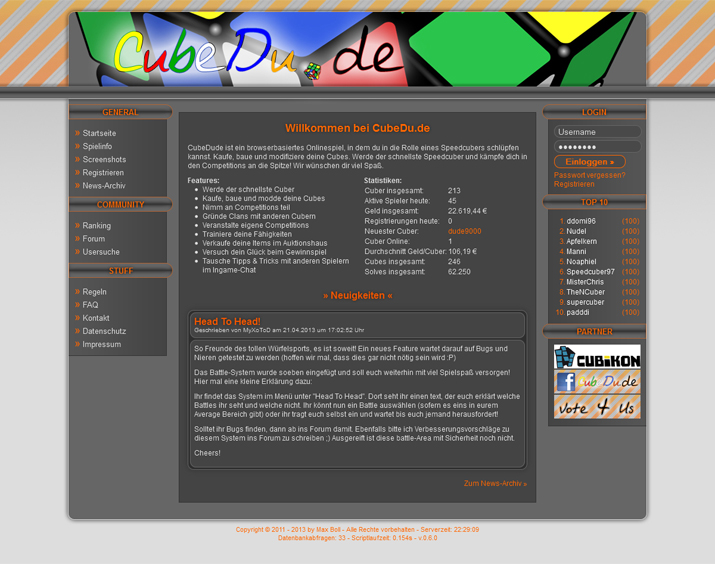

I started speedcubing around 2009 or 2010 and went to my very first competition in 2011. During that time I was a very active member of the offical forums. I found out, that there was a huge desire for a game that let&rsquo;s you step into the feet of a professional speedcuber&mdash;a speedcuber simulator or RPG if you will. Talking about this in one of the communities showed me that there were already a couple of people working on something but it seemed like there is no more progress so I decided to start my own project and hopefully give back to this amazing group of people.

## Development & Release

Same as for [hack-that.de](/projects/hack-that), I started coding with HTML, CSS, PHP, MySQL and a little bit of Javascript for timers. The PHP classes already looked a lot cleaner than in my previous projects and the whole structure was more thought of. Encountering new problems gave me so much more motivation, so I kept coding for about 1.5 years until I finally finished work.

Before going from closed beta to public I decided to ask a german speedcubing shop for a collaboration. I asked if it would be possible to receive a couple of coupon codes for their store so I could hand these out to the first users that signed up for CubeDu.de. To my surprise the shop owner was kind enough to accept this and sent me 25 coupon codes. <small>ngl, felt like a real business man here</small>

The name, CubeDu.de, originated in the forums where everything actually started. I opened up a thread asking people what this game should be called. I received a lot of suggestions and couldn&rsquo;t decide because there were so many good ones. In the end everyone agreed with CubeDu.de because of the word play &ldquo;dude&rdquo; and the german top level domain &ldquo;.de&rdquo;.

## What was it about?

You might have guessed it already but let me describe to you how people played the game in more detail. As mentioned before, the users would step into the feet of a professional speedcuber and experience the thrill of getting faster times in solving the rubik&rsquo;s cube. There were a couple of ways to earn in game money and spend it to improve skills (like speed and look-ahead) but also to join virtual competitions. The virtual competitions were the central point everything was about. Users would join by paying an entry fee and the best out of each competition would get the split price money.

After 2 years I decided to add another game mode called &ldquo;Head to Head&rdquo;, this is a term for battling another cuber 1 vs. 1. It gained a lot of popularity but during that time the active user count was already kind of low, so it became less interesting for people. This game was all about multiplayer and was not much fun with less and less active players.

After a few good years of a lot of fun and much learned I decided to discontinue the project. I thought about adjusting CudeDu.de and Hack-That.de one last time to be &ldquo;self-running&rdquo; but that's something for the future maybe. Self running meaning the game rounds would restart themselves. Both games are not infinite, they would restart after a couple of months so new users would get another chance of becoming the best.