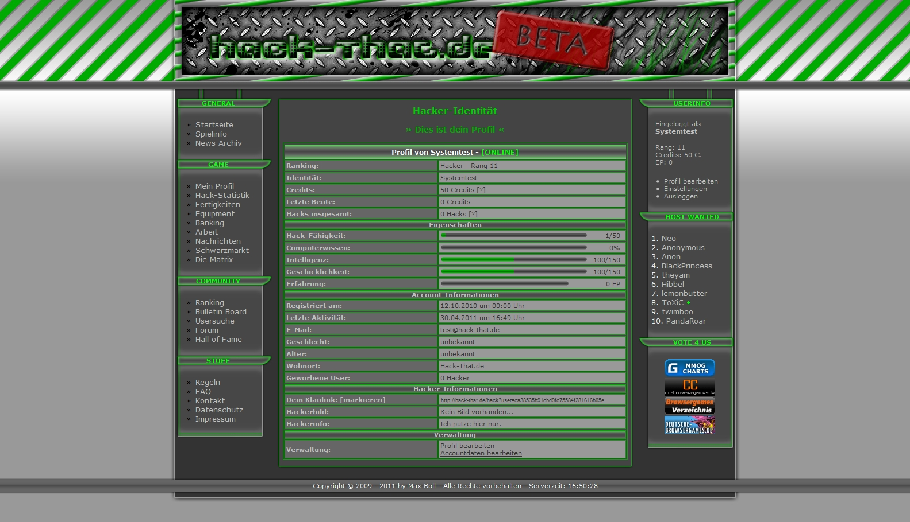

# Hack That

When I was 15 I started my first internship at a web-agency and soon after I would start my apprenticeship at the very same company. During that time I upped my HTML and CSS skills but also gathered new knowledge about PHP, MySQL and Javascript in various client projects. Didn't take long until I thought about my own projects apart from my website&mdash;it was the only &ldquo;project&rdquo; I was running back then.

browser games were still a big thing in 2009 and I was one of the people enjoying them. After contributing to a hacker-RPG kind of browser game I was hooked on creating my own game like this, this is how hack-that came to life.

---

It was a huge challenge for me to start something so big. I didn't even know how to set up everything and get started. So much to plan, so much to do. There were no excuses, so I kept going. Every evening, every night I was coding the website and planning new features alongside. OOP was still very new to me because I only recently started learning about PHP and my only success so far was a guesbook on my personal website that would store and read entries to and from the MySQL database.

After creating the first few classes I got the hang of it and work became easier. I continued for around one year and was finally able to publish the game. I did run a closed beta version to test everything with a couple of friends and after that I was very happy and pleased to finally throw it out into public.

The game had 100-200 active players during the best times and most of the time received good feedback. After a while I added some more features but also realised how bad the code quality really was. My skills got better over time and my feelings about hack-that's quality was getting worse. I still loved this project and I still do but at some point I decided to shut it down and say farewell.

I was sure that there are more games to follow after this one. Good lessons learned and improved my live a lot with this project.

## What was it about?

Hack-That.de was a hacker-RPG style browser game. Users would step into the life of a hacker and had various possibilities of earning money, buying better equipment, increasing their hacking skills and hacking other users.

---

A little side note: I want to share much more and detailed information about this project, so this page might be updated in the future. If you want to stay up to date, check back regularly. I will also try to start a local version and get some better screenshots to post here.